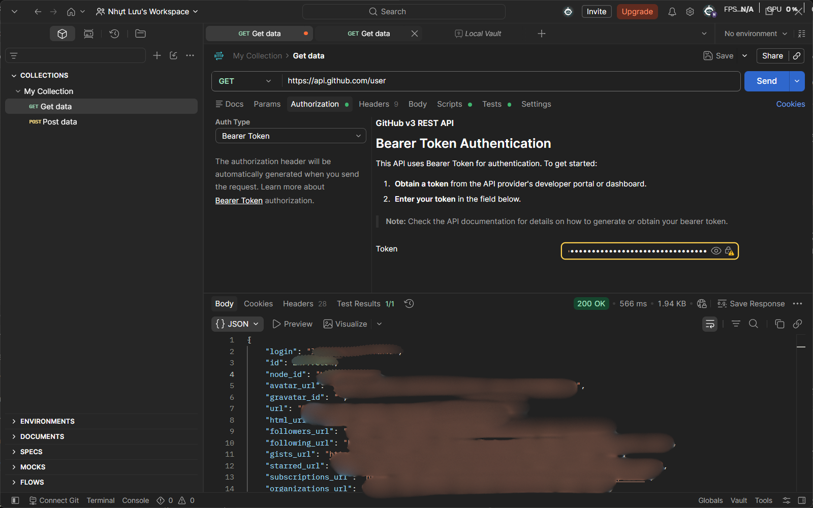

# Nghiên cứu cơ chế xác thực GitHub REST API

## 1. Địa chỉ cơ sở & cách xác thực

- **Base URL:** `https://api.github.com`
- GitHub REST API xác thực bằng **Personal Access Token (PAT)** gửi trong header `Authorization`.
- Endpoint dùng để vừa kiểm tra token vừa lấy thông tin tài khoản: `GET /user`.

## 2. Tạo và sử dụng Personal Access Token

1. GitHub → **Settings → Developer settings → Personal access tokens**.
2. Chọn **Fine-grained tokens** (khuyến nghị) → *Generate new token*.
3. Đặt **Expiration** (bắt buộc có hạn, tránh "No expiration").
4. Chọn **Repository access** (repo cụ thể cần tích hợp) và **Permissions** cần dùng.
5. **Generate token** → token chỉ hiện **một lần**, phải lưu ngay.
6. Dùng Postman: tab **Authorization** → **Auth Type: Bearer Token** → dán token vào ô Token.

**Fine-grained vs Classic token:**

| | Fine-grained | Classic |
|---|---|---|
| Phạm vi | Giới hạn theo repo & permission cụ thể | Toàn bộ repo cá nhân + tổ chức |
| Hạn dùng | Bắt buộc có ngày hết hạn | Có thể chọn "No expiration" |
| Khuyến nghị | **Ưu tiên dùng** | Chỉ dùng khi cần tính năng/Enterprise mà fine-grained chưa hỗ trợ |

## 3. Quyền (permission) cần thiết

| Nhu cầu | Fine-grained permission | Classic scope |
|---|---|---|
| Đọc thông tin repository | `Contents: Read-only`, `Metadata: Read-only` | `repo` (private) |
| Đọc danh sách commit | `Contents: Read-only` | `repo` |
| Đọc thông tin người dùng (`/user`) | Không cần permission repo, chỉ cần token hợp lệ | `read:user` |

## 4. Header bắt buộc khi gọi API

| Header | Giá trị |
|---|---|
| `Authorization` | `Bearer <token>` |
| `Accept` | `application/vnd.github+json` |
| `X-GitHub-Api-Version` | `2022-11-28` |

## 5. Request xác thực

```
GET https://api.github.com/user
Authorization: Bearer Token → {{github_token}}
Accept: application/vnd.github+json
```

Thiết lập trong Postman: tab **Authorization** → **Auth Type = Bearer Token** → token lưu trong biến environment, không gõ token thật vào file/collection rồi commit.

 

## 6. Lỗi xác thực thường gặp

| Mã lỗi | Thông báo | Nguyên nhân | Cách xử lý |
|---|---|---|---|
| `401` | `Bad credentials` | Token sai, hết hạn, đã bị thu hồi | Tạo token mới, kiểm tra không thừa khoảng trắng khi copy |
| `403` | `API rate limit exceeded` | Vượt hạn mức (60/giờ nếu không token, 5000/giờ nếu có token) | Thêm token vào request; hoặc chờ tới `x-ratelimit-reset` |
| `403` | `Resource not accessible by personal access token` | Token thiếu permission/scope cần thiết | Cấp thêm quyền tương ứng, tạo lại token |
| `404` | Not Found | Không có quyền truy cập repo private | Kiểm tra token có quyền đúng repo/org |

**Kiểm tra token còn hiệu lực:** gọi thử `GET /user` — trả `200` là còn hiệu lực, trả `401` là token sai/hết hạn/bị thu hồi.

## 7. Bảo vệ và lưu trữ token

- Không ghi token trực tiếp vào code, tài liệu, ảnh chụp, log; **không commit token lên GitHub**.
- Lưu token trong biến môi trường (`.env` + `.gitignore`) hoặc Postman Environment/Vault, secret manager.
- Luôn đặt ngày hết hạn, định kỳ xoay vòng (rotate) token, chỉ cấp quyền tối thiểu cần dùng.
- Nếu nghi lộ token: **revoke ngay** tại Settings → Developer settings → Personal access tokens, tạo token mới.

---

