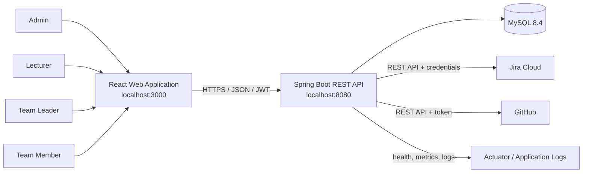

# CNPM-18 - System Architecture

## 1. Purpose

The system supports requirements and project-progress management for a software-project course. It does not replace Jira or GitHub. It consolidates their data, applies course roles, links tasks to development activity and produces reports for lecturers and students.

The architecture follows a modular monolith for the Spring Boot backend. This is appropriate for the current team size and four-week delivery window: deployment stays simple while package boundaries preserve the option to split integrations or reporting later.

## 2. Context

### Human actors

- **Admin** manages accounts, lecturers, student groups, assignments and integration configuration.
- **Lecturer** supervises assigned groups and views requirements, progress and contribution reports.
- **Team Leader** manages group requirements and tasks, assigns work and monitors synchronization.
- **Team Member** views assigned tasks, updates status and reviews personal commits, tests and statistics.

### External systems

- **Jira Cloud REST API** provides projects, issues, backlog and sprint information.
- **GitHub REST API** provides repositories, commits, pull requests, users and workflow runs.

## 3. Container view

The editable draw.io version is stored in `architecture.drawio`.

## 4. Backend component view

| Component/package | Responsibility | Depends on |
|---|---|---|
| `auth` | Login contract, credential validation and login response | `identity`, `security`, `common` |
| `security` | JWT creation/validation, request authentication, `401/403`, role rules and CORS | `identity`, Spring Security |
| `identity` | User/role domain and persistence | MySQL/JPA |
| `group` | Student groups, members, leaders and lecturers | `identity` |
| `project` | Project metadata and external project mapping | `group` |
| `requirement` | Requirement/SRS information synchronized from Jira | `project`, Jira integration |
| `task` | Local task state, assignment and task-development links | `project`, `requirement`, integrations |
| `integration.jira` | Jira authentication, client and synchronization adapters | Jira Cloud REST API |
| `integration.github` | GitHub client and activity collection adapters | GitHub REST API |
| `linking` | Jira task-key convention and Task-Commit-PR matching | `task`, GitHub data |
| `reporting` | Progress and contribution aggregation | synchronized and local data |
| `audit` | Activity timeline and synchronization traceability | application events/MySQL |
| `monitoring` | Health, metrics and operational diagnostics | Spring Boot Actuator |
| `common` | Shared API envelope, exceptions, persistence base and correlation ID | none |

## 5. Request flows

### Login and authorization

1. React sends `POST /api/v1/auth/login` with `usernameOrEmail` and `password`.
2. `AuthController` validates the request contract.
3. `AuthService` finds an active user and checks the BCrypt password hash.
4. `JwtTokenProvider` signs a token containing username and role.
5. React stores the session token and navigates to the dashboard for the returned role.
6. Later requests include `Authorization: Bearer <token>`; `JwtAuthenticationFilter` restores the security context.
7. Spring Security returns `401` for anonymous access and `403` for an authenticated user with an insufficient role.

### Synchronization

1. A scheduled or user-triggered use case loads the encrypted integration configuration.
2. The provider adapter calls Jira or GitHub with timeout and pagination controls.
3. The service maps remote DTOs to local synchronized records using provider IDs and unique keys.
4. The transaction commits the snapshot and records a `sync_logs` entry with a correlation ID.
5. Failure details are sanitized, stored for diagnosis and displayed without exposing secrets.

## 6. Data ownership and consistency

| Data | Authoritative source | Local behavior |
|---|---|---|
| Accounts, roles, groups and permissions | MySQL | Created and managed locally |
| Jira issue/task/sprint state | Jira | Stored as synchronized snapshots/mappings |
| Repository, commit, PR and workflow data | GitHub | Stored as synchronized activity records |
| Task-Commit-PR links | MySQL | Derived automatically or confirmed manually |
| Reports, SRS versions and audit logs | MySQL | Derived from synchronized and local data |

Flyway is the only mechanism allowed to change the production schema. Hibernate uses `ddl-auto=validate` so entity/schema drift fails fast.

## 7. Security decisions

- Passwords are stored only as BCrypt hashes.
- JWT signing secret and integration encryption key come from environment variables.
- Jira/GitHub secrets are encrypted before persistence.
- API errors never return stack traces, passwords, tokens or provider secrets.
- Every protected API is restricted by role and group scope.
- CORS allows only the configured frontend origin during local development.

## 8. Deployment view

For local development, React, Spring Boot and MySQL run as three processes on one workstation. The repository also contains `compose.yml` for a reproducible MySQL service. A later deployment may serve the React build through a web server, run the Spring Boot JAR as one application service and use a managed MySQL instance.

## 9. Acceptance checklist

- [x] Identifies all four human actors.
- [x] Shows React, Spring Boot, MySQL, Jira and GitHub boundaries.
- [x] Defines backend package responsibilities.
- [x] Documents authentication and synchronization flows.
- [x] Defines data ownership, security and deployment decisions.
- [x] Provides an editable draw.io diagram.

