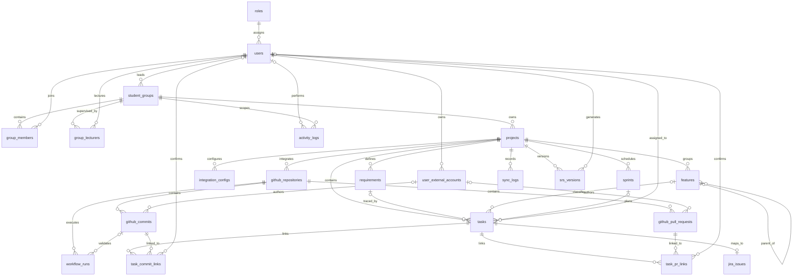

# CNPM-19 - Initial Entity Relationship Diagram

## 1. Scope and source of truth

This ERD represents the physical schema created by `V1__create_core_schema.sql`. Flyway remains the executable source of truth. Column-level definitions are recorded in `database-design.md`.

## 2. Domain grouping

| Domain | Tables |
|---|---|
| Identity and access | `roles`, `users`, `user_external_accounts` |
| Academic groups | `student_groups`, `group_members`, `group_lecturers` |
| Project planning | `projects`, `requirements`, `features`, `sprints`, `tasks` |
| Jira integration | `integration_configs`, `jira_issues`, `sync_logs` |
| GitHub integration | `github_repositories`, `github_commits`, `github_pull_requests`, `workflow_runs` |
| Traceability | `task_commit_links`, `task_pr_links` |
| Reporting and audit | `activity_logs`, `srs_versions` |

## 3. Cardinality rules

- Every user has exactly one global role; one role can be assigned to many users.
- A student group may have one leader and many active/historical members.
- A lecturer can supervise many groups and a group can have many lecturers.
- Every project belongs to exactly one student group.
- A task belongs to one project and may reference one requirement, feature, sprint and assignee.
- A task has at most one synchronized Jira issue.
- A project can connect to many GitHub repositories.
- Tasks and commits/PRs have many-to-many relationships represented by link tables.
- Synchronization and activity records are append-oriented operational history.

## 4. Consistency constraints

- Provider identifiers and Jira/GitHub keys use unique constraints to make synchronization idempotent.
- Junction tables use composite primary keys to prevent duplicate memberships and links.
- Self-referencing `features.parent_feature_id` supports a feature hierarchy.
- Nullable foreign keys represent optional mappings, not unknown mandatory ownership.
- Deletion is intentionally not cascaded in Sprint 1; services must prevent deleting referenced records or implement an explicit archival policy.

## 5. Acceptance checklist

- [x] Contains every table created by Flyway V1.
- [x] Shows primary relationships and cardinalities.
- [x] Separates identity, planning, integration, traceability and audit domains.
- [x] Defines key uniqueness and optionality decisions.
- [x] Provides an editable draw.io overview and Mermaid source.

