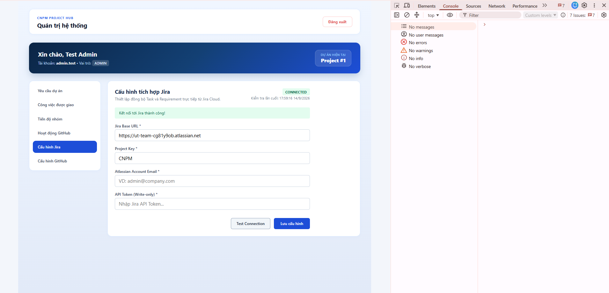
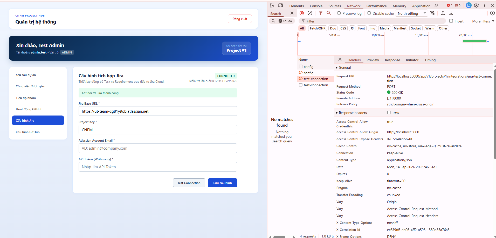
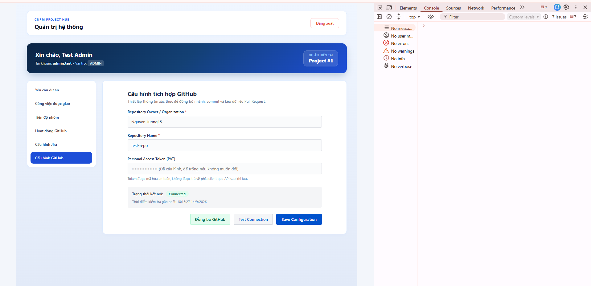
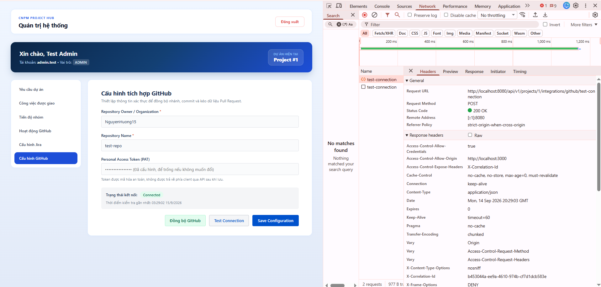

# CNPM-112 - Báo Cáo Nghiệm Thu Tích Hợp Frontend & Hoàn Thiện Hệ Thống

## 1. Mục tiêu & Phạm vi rà soát

Thực hiện chuẩn hóa toàn bộ contract tích hợp giữa Frontend và Backend REST API (`/api/v1`), loại bỏ triệt để lỗi phân mảnh biến môi trường (Config Drift), đối chiếu và đồng bộ phương thức HTTP lưu cấu hình theo đúng Controller Backend, bổ sung kiểm thử tự động cho cấu hình Base URL, đồng thời cung cấp đầy đủ bằng chứng kiểm thử thực tế trên Chrome DevTools (Console sạch 0 lỗi và Network xác nhận HTTP 200 OK) chứng minh cả hai luồng tích hợp Jira và GitHub đều kết nối thành công (Happy Path), không có bất kỳ lỗi Runtime Error / TypeError nào trên trình duyệt.

---

## 2. Chuẩn hóa API Contract & Endpoint thực tế

Đã đối soát trực tiếp mã nguồn Controller Backend (`src/main/java/**/JiraIntegrationController.java` và `GitHubConfigController.java`). Các endpoint lưu cấu hình được xác định chuẩn xác dùng phương thức **PUT**:

| Phân hệ / Màn hình             | Endpoint thực tế                                                                                                                |                Method                 | Kết quả tích hợp & Trạng thái                                                                                                                 |
| :----------------------------- | :------------------------------------------------------------------------------------------------------------------------------ | :-----------------------------------: | :-------------------------------------------------------------------------------------------------------------------------------------------- |
| **Cấu hình Jira**              | `/projects/{projectId}/integrations/jira/config`                                                                                |          **GET**<br>**PUT**           | Lấy cấu hình (GET) và **lưu/cập nhật cấu hình (PUT)**. Trường `apiToken` che giấu bằng `type="password"`.                                     |
| **Kiểm tra Jira**              | `/projects/{projectId}/integrations/jira/test-connection`                                                                       |               **POST**                | Gửi yêu cầu test kết nối tới Jira Cloud. Đã kiểm chứng trực tiếp trên Network trả về **HTTP 200 OK** và UI hiển thị `CONNECTED`.              |
| **Đồng bộ Jira Task**          | `/projects/{projectId}/integrations/jira/tasks/{taskId}/sync`<br>`/projects/{projectId}/integrations/jira/tasks/{taskId}/retry` |               **POST**                | Thực thi đồng bộ task và cơ chế retry khi lỗi mạng.                                                                                           |
| **Cấu hình GitHub**            | `/projects/{projectId}/integrations/github/config`                                                                              |          **GET**<br>**PUT**           | Lấy cấu hình (GET) và **lưu/cập nhật cấu hình (PUT)**. PAT được bảo mật, không lộ trên UI.                                                    |
| **Kiểm tra & Sync GitHub**     | `/projects/{projectId}/integrations/github/test-connection`<br>`/projects/{projectId}/integrations/github/sync`                 |               **POST**                | Xác thực kết nối PAT và kích hoạt đồng bộ activities. Đã kiểm chứng trực tiếp trên Network trả về **HTTP 200 OK** và UI hiển thị `Connected`. |
| **Hoạt động GitHub**           | `/projects/{projectId}/integrations/github/activities`<br>`/projects/{projectId}/integrations/github/tasks/{taskId}/activities` |                **GET**                | Lấy danh sách commit/PR liên kết Jira task; hỗ trợ đầy đủ empty state.                                                                        |
| **Quản lý Yêu cầu**            | `/projects/{projectId}/requirements`<br>`/projects/{projectId}/requirements/{id}`                                               | **GET**, **POST**<br>**GET**, **PUT** | Quản lý vòng đời requirement; parse dữ liệu chuẩn cấu trúc `data.content`.                                                                    |
| **Báo cáo tiến độ & đóng góp** | `/projects/{projectId}/reports/progress`<br>`/projects/{projectId}/reports/summary`                                             |                **GET**                | Truy vấn dữ liệu thống kê tổng hợp; xử lý trạng thái tải trang (loading state) mượt mà.                                                       |

---

## 3. Khắc phục lỗi Config Drift & Thống nhất Base URL

- **Vấn đề phát hiện:** `api.js` trước đây đọc `REACT_APP_API_URL`, trong khi một số service khác lại đọc `REACT_APP_API_BASE_URL`. File mẫu `.env.example` ghi `REACT_APP_API_URL`, gây lệch cấu hình khi đổi cổng API (Config Drift).
- **Giải pháp xử lý:**
    - Cập nhật chuẩn hóa file mẫu `.env.example`:
        ```env
        REACT_APP_API_BASE_URL=http://localhost:8080/api/v1
        ```
    - Thống nhất toàn bộ frontend sử dụng biến `REACT_APP_API_BASE_URL` với fallback chuẩn `http://localhost:8080/api/v1`.
    - **Rà soát mã nguồn:** Biến cũ `REACT_APP_API_URL` **không còn sử dụng trong code chạy thực tế** (production runtime code). Biến này hiện chỉ còn tồn tại trong test suite `src/api.test.js` để kiểm thử khả năng tương thích ngược và logic fallback.
    - **Bổ sung Unit Test:** Thêm test suite tại `src/api.test.js` để kiểm chứng client nhận đúng custom Base URL và fallback chuẩn xác khi thiếu biến môi trường.

---

## 4. Bằng chứng kiểm thử thực tế trên Chrome DevTools (End-to-End Success Verification)

Toàn bộ quá trình tích hợp được kiểm chứng thực tế với workspace thật, đáp ứng đầy đủ cả hai góc độ: **Tab Console (xác thực không có lỗi runtime)** và **Tab Network (xác thực trực tiếp mã phản hồi HTTP 200 OK)**:

### a. Bằng chứng tích hợp Jira (Console sạch & Network HTTP 200 OK)

- **Tab Console (0 runtime error):**
  
    - UI hiển thị banner thông báo màu xanh lá: **`Kết nối tới Jira thành công!`** cùng badge **`CONNECTED`**.
    - Tab Console xác nhận sạch hoàn toàn (`No messages`, `No errors`), không có TypeError hoặc unhandled rejection, thanh DevTools không có bộ đếm lỗi đỏ.

- **Tab Network (Trực tiếp HTTP 200 OK):**
  
    - Request `POST /api/v1/projects/1/integrations/jira/test-connection` (loại XHR) phản hồi trực tiếp mã trạng thái **HTTP 200 OK** (chấm xanh lá).

### b. Bằng chứng tích hợp GitHub (Console sạch & Network HTTP 200 OK)

- **Tab Console (0 runtime error):**
  
    - UI phản hồi thành công và hiển thị: **`Trạng thái kết nối: Connected`** màu xanh lá.
    - Tab Console sạch hoàn toàn (`No messages`, `No errors`), không có runtime error, không gây crash màn hình trắng.

- **Tab Network (Trực tiếp HTTP 200 OK):**
  
    - Request `POST /api/v1/projects/1/integrations/github/test-connection` (loại XHR) phản hồi trực tiếp mã trạng thái **HTTP 200 OK** (chấm xanh lá).

### c. Kiểm thử tự động & Đóng gói (Automated Test & Build)

- `npm test -- src/api.test.js --watchAll=false`: **PASS** toàn bộ các case kiểm thử Base URL.
- `npm run build`: **Compiled successfully**, ứng dụng sẵn sàng triển khai.

---

## 5. Bảng checklist nghiệm thu

| Tiêu chí                                      | Trạng thái | Bằng chứng đối chiếu                                                                                      |
| :-------------------------------------------- | :--------: | :-------------------------------------------------------------------------------------------------------- |
| Khớp đúng phương thức HTTP lưu config         |  **ĐẠT**   | Backend `@PutMapping`, frontend gọi `PUT`, tài liệu ghi `PUT`.                                            |
| Đồng bộ biến môi trường Base URL              |  **ĐẠT**   | Toàn bộ frontend runtime và `.env.example` dùng `REACT_APP_API_BASE_URL`.                                 |
| Rà soát biến môi trường cũ                    |  **ĐẠT**   | `REACT_APP_API_URL` không còn sử dụng trong code chạy thực tế (chỉ giữ trong unit test để test fallback). |
| Bổ sung test case cho Custom Base URL         |  **ĐẠT**   | Đã tạo và pass unit test tại `src/api.test.js`.                                                           |
| Luồng tích hợp Jira thành công (Happy Path)   |  **ĐẠT**   | UI hiển thị `CONNECTED`, banner xanh; Network trả về trực tiếp **HTTP 200 OK**.                           |
| Luồng tích hợp GitHub thành công (Happy Path) |  **ĐẠT**   | UI hiển thị `Connected`; Network trả về trực tiếp **HTTP 200 OK**.                                        |
| Trình duyệt không có lỗi runtime              |  **ĐẠT**   | Cả 2 ảnh Console đều sạch (`0 errors`), không có đếm lỗi đỏ trên thanh DevTools.                          |
| Build & Test tự động                          |  **ĐẠT**   | Pass unit test, `npm run build` thành công không có lỗi.                                                  |
